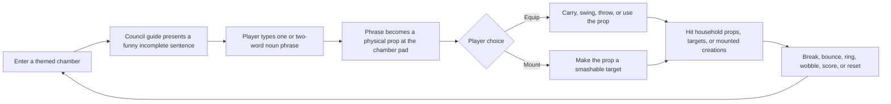
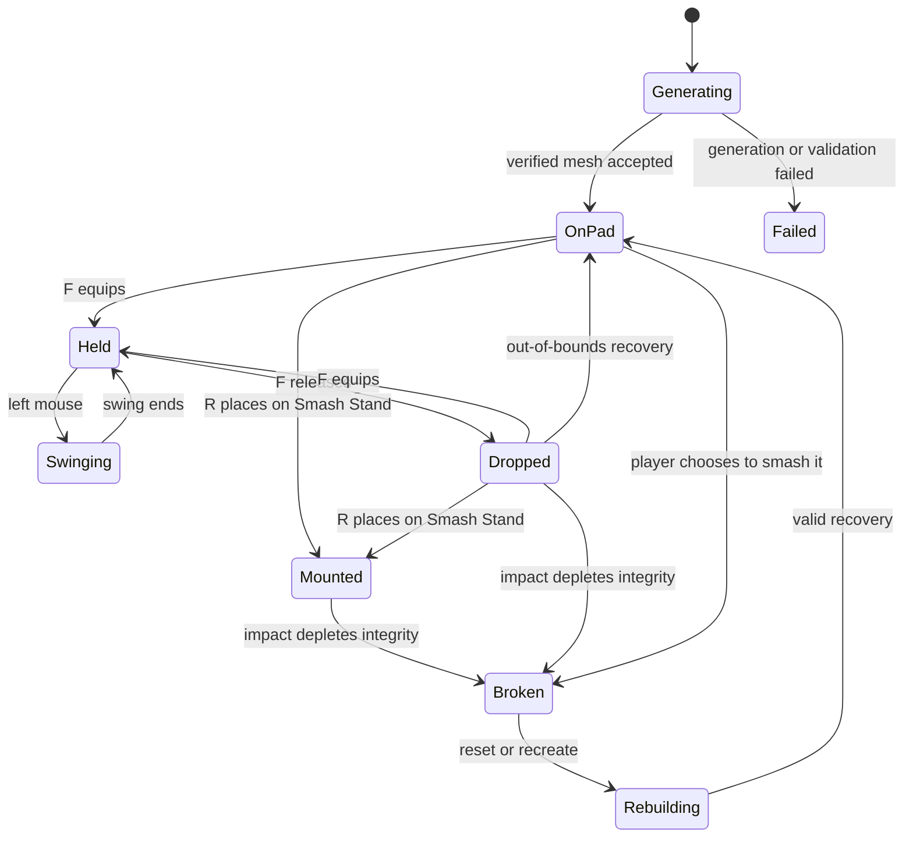

# Game Plan: **Archetypes — The Inner Chambers Smash Room**

**Date:** 2026-09-08
**Status:** **PENDING — game redesign and vertical-slice plan**
**Product statement:** **Archetypes is a game about making meaning physical, then seeing what happens when it hits something.** The Inner Chambers are not a viewer for generated assets. They are a beautiful, traversable **Smash Room pilgrimage**: seven archetypal play spaces where the council turns absurd language into props, and the player decides whether each prop is a tool, a toy, a target, or all three.

> **The core joke is also the core mechanic:** an archetype gives the player an incomplete sentence, the player completes it with a simple noun phrase, and that phrase becomes a physical object. A dinner turkey can become a club. A circus clown can become a club. Or the player can mount the turkey on a smash stand and use the circus clown to destroy it. The language is the setup; physics is the punchline.

The real-world comparison is a smash room: a contained place where people pay to break mundane things for catharsis and amusement. This game inherits the **safe, theatrical joy of destruction**, not the price of admission or real harm. Its targets are authored household props, carnival dummies, abstractions, and generated objects. The council members are guides and commentators, never targets.

## 1. Why this is a game worth playing

This concept becomes original when the council is not a menu wrapped around a model call. Each archetype has a worldview, visual language, room, voice, prompt style, and **smash physics**. The player does not merely read the Architect’s idea of structure or the Jester’s idea of disruption; the player uses a generated object to test, bend, bounce, break, and laugh at those ideas.

The game’s cadence is deliberately human: curiosity, anticipation, possession, absurdity, impact, recovery, and one more try. It needs spaces that feel good to enter, objects that feel satisfying to hold, breakables that react honestly, and council guidance that adds wit without slowing the player down.



### 1.1 The player fantasy

The player should feel that they are entering a series of spectacular, weirdly intimate playrooms built by distinct minds. The Architect invites them to test structure with something ridiculous. The Sentinel makes them confront boundaries with a toy that should not be allowed through them. The Jester creates a room where the wrong answer is usually the funny answer. The council makes a suggestion, then gets out of the way while the player turns that suggestion into slapstick.

The player can always decide what a created object means in play. A prop on the pad may be **equipped** and used to hit the room. Or it may be **mounted** on a smash stand, where it becomes a vulnerable target for another prop. This produces the essential absurd reversal: the player can generate a dinner turkey as a fragile target, then generate a circus clown as the thing used to smash it. The game does not need to claim that a language model truly understands turkeys or clowns. The joke works because the player understands the sentence, sees the prop, and chooses the collision.

### 1.2 Non-negotiable success conditions

| Player-facing outcome | What it means in practice | What does **not** count |
|---|---|---|
| **A world worth walking through** | The hub and first chamber have architecture, scale, lighting, landmarks, sound, readable collision, and a reason to keep moving. | A large plane with colored primitives, brighter emission, or more HUD text. |
| **Immediate physical agency** | The player can walk, jump, look, grab, swing, drop, mount, and recover props before the generator is involved. | Watching a proxy animate while a process runs. |
| **Language becomes a punchline** | A simple player-entered noun phrase visibly completes a chamber line and becomes the object at the pad. | A generic freeform prompt field with council decoration. |
| **The council is alive but never a bottleneck** | The relevant archetype offers a concise, in-character cue or reaction; gameplay is usable immediately even if the LLM is slow or unavailable. | A 90-second chat wait before the player can use a pad. |
| **Destruction feels good** | A hit has a clear contact sound, visible motion/damage, controlled debris or material swap, and a reset/recovery rule. | A hidden health decrement, a particle burst without contact, or a score increment with no physical effect. |
| **The absurdity is repeatable** | The same noun can be created again without confusing results, losing an item, duplicating ownership, or corrupting save state. | A one-shot demo that works only for a specific hard-coded banana. |

## 2. The Smash Room pilgrimage

The Inner Chambers become a traversal game. The central concourse is the threshold: it offers orientation, a large visible landmark, seven compelling room entrances, and a clear way to see that every chamber promises a different kind of play. The chambers are not seven reskins of the same arena. Each is an authored proposition about destruction, material, rhythm, and humor.

The player begins with a **directed creation card** in each chamber. Completing the card unlocks the chamber’s optional free-forge pad behavior. This gives early visits an authored comic setup while retaining the long-term freedom of making arbitrary simple props. The game does not ask the player to pay money, grind currency, or perform ledger ceremony. Progress is curiosity: “What happens if I make *that* in *this* room?”

### 2.1 Chamber design matrix

The following interpretations are proposed gameplay uses of the existing archetype theme tokens. They are not claims that the current code already has rooms, profiles, physics, or targets. Existing themes provide color, motion, and harmonic identity; environment art and mechanics must be authored deliberately. [1]

| Chamber | Existing theme evidence | Proposed room fantasy | Directed prompt example | Pad modifier and physical play | Primary smash target |
|---|---|---|---|---|---|
| **Architect — Luminous Blueprint** | Pale structural palette, blueprint cyan accent, controlled motion, C-major identity. [1] | A soaring blueprint workshop where beams, measuring rigs, drafting lights, and floating structural frames make scale readable. | “To test a load-bearing idea, I need a **_____**.” | **Structural.** Objects are stable, weighty, and precise; good for controlled knocks and testing stacked props. | Resettable blueprint lamp array or modular block tower. |
| **Sentinel — Null Aegis** | Dark void, lawful blue/red accents, rectilinear motion, tritone tension. [1] | A defended archive with gates, inspection lanes, alarm pylons, and heavy doors. | “A proper boundary should stop a **_____**.” | **Armored.** Props are durable and heavy with slower swings and strong impact. | Breakaway security barricade and ringing alarm stack. |
| **Mentor — Ancient Resonance** | Deep teal, slow unfolding motion, resonant-bowl identity. [1] | A warm acoustic hall of hanging bowls, shelves, tea ware, and resonance frames. | “A lesson travels best inside a **_____**.” | **Resonant.** Props ring, wobble, and transfer modest force; breakables emphasize sound and vibration. | Ceramic chorus: resettable bowls, lamps, and chimes. |
| **Explorer — Frontier Flare** | Dark field, orange/gold accents, buoyant motion, rising arpeggio. [1] | A storm-battered expedition depot with ropes, crates, wind indicators, and an open horizon. | “For uncharted trouble, pack a **_____**.” | **Kinetic.** Props are light, lively, and later suitable for a safe throw mechanic. | Supply-crate stack and springy route markers. |
| **Oracle — Noctis Veil** | Deep indigo, violet accents, slow ethereal motion, distant bells. [1] | A moonlit cabinet of curiosities with mirrors, veils, omen lamps, and shadowed display stands. | “The omen clearly foretold a **_____**.” | **Uncanny.** Props have ordinary bounded physics but unusual visual/audio feedback; no invisible or uncollidable gimmicks in the first release. | Glassy omen vessels and a clearly non-sentient fortune dummy. |
| **Empath — Luma Resonance** | Warm rose palette, breathing cadence, soft harmony. [1] | A luminous conservatory/living room with cushions, lamps, soft furnishings, and responsive light forms. | “When a room gets tense, offer it a **_____**.” | **Cushioned.** Props feel soft, squash visually, and impart low impact; comedy comes from bounce and recoverability. | Soft household clutter and gentle spring targets. |
| **Jester** | Chalk/off-white, near-black, bruise indigo, sparing truth-sting red; asymmetric/bouncy motion; dissonant glitch. [1] | A worn carnival repair workshop: impossible tool racks, upside-down lamps, clown-dummy rigs, and comic reset machinery. | “Every safe circus needs a **_____**.” | **Slapstick.** Props bounce, squeak, wobble, and create controlled exaggerated feedback. | Carnival clown dummy, balloon-light rig, and resettable prop stack. |

### 2.2 The first fully playable room is Jester

The **Jester chamber** is the correct vertical slice, even if Architect remains the most natural environment-art reference. The requested premise is not “a generated object can be imported.” It is “a dinner turkey can fight a circus clown and the result is funny.” Jester is the room that makes this undeniable.

The first Jester slice should include a compelling entry silhouette, a manifestation pad, one **Smash Stand** that can mount player-created objects, a non-sentient carnival clown dummy, a breakable household-light rig, a Lost & Found return chute, and enough open floor for a held object to swing without clipping walls. Architect becomes the second room, where the same system proves it can create satisfying *structure* rather than only slapstick.

## 3. The council’s job: guide, provoke, react

The council should not deliver a long quest briefing or debate the player’s noun. Its job is to make the room feel inhabited and to frame the ridiculousness in the archetype’s own voice. The player gets a crisp situation, chooses a word, and acts.

### 3.1 The manifestation card

A manifestation card is an authored game object, not an open-ended LLM instruction. It contains the chamber identifier, a sentence template, a named blank, a pad modifier, a target suggestion, and a small deterministic fallback reaction. The card controls validation and game state. The LLM can add character, but it may not decide whether a word is valid, what collider the object receives, whether a hit counts, or whether progression advances.

```text
JESTER — SLAPSTICK CARD 01

“Every safe circus needs a [________________].”

Type one simple object noun or two-word noun phrase.
Examples: rubber chicken · dinner turkey · circus clown

Forge it at the Slapstick Pad.
Then choose: [F] Equip it  |  [R] Mount it on the Smash Stand
```

### 3.2 Input rules

- [ ] Accept one simple noun or a two-word noun phrase only; use printable characters and a documented length cap.
- [ ] Render the completed sentence before generation so the player can see and enjoy the joke they created.
- [ ] Reject blank input, control characters, and text exceeding the one/two-word policy with a plain explanation. This is input discipline, not semantic moderation theatre.
- [ ] Keep the exact noun phrase in the `CreationContract`, world-prop label, persistence record, and local audit event.
- [ ] Allow the player to abandon the card with `Esc` and remain in the room. A failed or cancelled idea never ejects the player from the game.

### 3.3 LLM guidance without making the game wait

The existing Consciousness/Standard Mecha path establishes a usable pattern: one selected archetype supplies a static persona, local Ollama work occurs on a background thread, and the UI polls a channel without blocking Bevy. It has a 90-second service timeout and explicit failures. [2] The council chamber also has a background deliberation and per-archetype voice system. [3] Those are **patterns to adapt**, not a ready-made Smash Room dialogue API.

- [ ] Extract immutable, reusable `ArchetypeProfile` data from the mode-private Standard Mecha records: archetype ID, display name, stable persona, art-style tokens, and short deterministic fallback lines. Do not import private mode UI/session types into Inner Chambers. [2]
- [ ] Introduce a small `GuideSession` scoped to the current chamber visit. It records the active card, player noun phrase, latest guide line, and request UUID; it is not a clone of the long-form Consciousness chat transcript.
- [ ] The authored card and input surface appear immediately. The guide line is optional enrichment dispatched in a worker after the player enters the chamber or submits a valid phrase.
- [ ] Send only bounded structured context to the local LLM: active archetype persona, room name, card template, player phrase when present, and a request for one short funny, non-hostile line. Do not send arbitrary save data or ask the LLM to invent game rules.
- [ ] The UI uses a deterministic profile-authored line if Ollama, Sentinel authorization, or the LLM request fails or is late. The player can forge and smash regardless.
- [ ] Voice playback is a follow-up enhancement. Reuse the existing per-archetype speaker mapping and non-blocking audio pattern only after the text-card loop is fun. A voice failure must never delay the prompt or lock player controls. [3]

## 4. A created thing has two destinies: equip or destroy

The created object must be a proper world prop, not a decorative mesh. It has a physical state, a name, a source chamber, a pad modifier, bounded collision data, integrity, and a clear current role. Its render mesh is the visual object; its gameplay collider is a safe fitted primitive/proxy derived from validated bounds.

### 4.1 Prop state model



| State | Gameplay behavior | Player meaning |
|---|---|---|
| `Generating` | Visible proxy only; never grab-able or hittable. | “My strange idea is being made.” |
| `OnPad` | Settled prop with a fitted collider and a short interaction prompt. | “I can pick this up, mount it, or leave it here.” |
| `Held` | The prop visibly follows the right-hand anchor; player collision is disabled; swing collision is inactive until an attack. | “This is my ridiculous club.” |
| `Swinging` | A time-bounded hand arc and swept hit shape run once per target per swing. | “I committed to a hit.” |
| `Dropped` | Bounded dynamic prop; it sleeps/stabilizes and can be picked up or mounted. | “It is still in the world.” |
| `Mounted` | The prop is placed on the Smash Stand and becomes a legitimate target. | “I have chosen to sacrifice this thing.” |
| `Broken` | Controlled mesh/material swap, fragments, sound, and reset/recovery affordance. | “The thing broke because I made it break.” |
| `Failed` | Failed proxy and concise diagnostic; no fake primitive replaces it. | “The idea did not arrive; the game is being honest.” |

### 4.2 The turkey-and-clown proof sequence

This is the whole game in four actions, and it should become the first end-to-end playable test after fixture-prop physics is working.

1. In one room, the player completes a card with **dinner turkey**. The verified turkey-shaped mesh appears on the manifestation pad.
2. The player presses `R` at the Smash Stand to mount the turkey as a fragile smash target, or uses the room’s secondary mount interaction to place it there.
3. In the Jester room, the player completes a card with **circus clown**, grabs the clown-shaped physical prop with `F`, and walks to the mounted turkey.
4. The player swings the clown into the turkey. The turkey takes the impact, reacts, breaks in a controlled funny way, and can be restored/recreated; the clown remains an object the player can drop, carry, or later sacrifice.

This sequence makes the role reversal explicit. Every generated object can be a tool or a victim. The player creates the comedy by deciding which one deserves to be swung and which one deserves to be smashed.

### 4.3 Smash profiles: room rules, not fake semantic understanding

A mesh generator cannot reliably tell the game whether “dinner turkey” is soft or “circus clown” is bouncy. Therefore, the first release assigns physics through the **chamber pad modifier**, not a hallucinated semantic material classifier. The player knows what room they are in, sees the card modifier, and gets consistent play.

| Pad modifier | Durable behavior | Comic feedback | Suitable chamber |
|---|---|---|---|
| `Structural` | High integrity, stable mass, low bounce. | Crisp impact, clean stack displacement. | Architect |
| `Armored` | High integrity, heavy swing, capped speed. | Deep thud, alarm shake. | Sentinel |
| `Resonant` | Medium integrity, moderate impulse. | Chime, bowl ring, sustained wobble. | Mentor |
| `Kinetic` | Lower mass, lively response. | Rattle, trail, later-safe throwing. | Explorer |
| `Uncanny` | Medium integrity, normal collision. | Strange but readable sound/light response. | Oracle |
| `Cushioned` | Low impact, soft response, strong recovery. | Squash, puff, gentle bounce. | Empath |
| `Slapstick` | Medium integrity, high controlled bounce. | Squeak, boing, exaggerated wobble. | Jester |

A future, opt-in **Smash Tag** selection could let the player choose a modifier explicitly at the pad. It does not belong in the first vertical slice; one clear room-to-physics rule is more fun than a confusing material menu.

## 5. The physical sandbox

The current engine has free-flight camera movement and no physics dependency. [4] The Living Engine offers a useful **architectural** precedent—headless simulation state projected into ECS visuals—but it implements stylized orbital pseudo-physics, not collision, rigid bodies, weapons, breakables, or damage. [5] A real smash room requires a deliberate physics foundation.

### 5.1 Movement must feel grounded

- [ ] Replace normal Inner Chambers free vertical flight with a grounded player body, world collision, step/jump behavior, and first-person camera. Retain a developer-only navigation aid separately if it remains useful for authoring.
- [ ] Establish a maintained physics solution compatible with the project’s Bevy `0.18.1` dependency; verify version compatibility, license, compilation, player capsule, static world colliders, dynamic prop, and raycast in a contained spike before committing gameplay to it. [6]
- [ ] Keep the physics integration behind a narrow `physics` boundary. Inner Chambers should consume domain concepts such as grounded, raycast hit, dynamic prop, trigger, and impact event rather than scattering engine-specific types across world/UI code.
- [ ] Build authored visible surfaces first, then attach matching static colliders. A wall, ramp, stand, shelf, or target zone must visibly explain every collision.
- [ ] Use a fixed, camera-tested first-person field of view, reach, sprint/jump values, hand position, and swing space. A player must be able to see both the object and the thing it is about to hit.

### 5.2 Hands, holding, and swings

- [ ] Add visible first-person hands/gauntlets with idle, walk, grab, and swing motion. The right hand is the first-release gameplay slot; the left hand is presentation/support.
- [ ] Add `PlayerHands { held_entity: Option<Entity>, ... }` and one authoritative `WorldProp` ownership state. An object cannot be held, mounted, broken, or owned by two systems at once.
- [ ] Raycast from the center reticle over a short, tested range. Only a generated/fixture prop in `OnPad` or `Dropped` state is eligible for `F — Equip`.
- [ ] `F` toggles equip/drop. Releasing a prop applies capped linear/angular velocity derived from the hand; it cannot launch an object into unstable simulation.
- [ ] Left mouse performs a short startup/active/recovery swing. During the active window, sweep a capsule or sphere between successive weapon-tip transforms so a fast swing cannot tunnel through a target.
- [ ] Maintain a per-swing target hit set. One target receives one registered hit per swing regardless of frame rate.
- [ ] Add throwing only after grab, drop, swing, impact, and recovery are reliable. Throwing uses a separate capped impulse; it is not required for the first banana/turkey/clown proof.

### 5.3 Props, targets, and breakage

- [ ] A `WorldProp` has an operation UUID, creator chamber, card ID, noun phrase, pad modifier, source mesh hash/path, normalized bounds, fitted collider profile, integrity, state, and optional mounted stand ID.
- [ ] Fit generated props with safe simple gameplay colliders—box, capsule, or convex proxy based on normalized bounds. Never create a dynamic triangle-mesh collider from untrusted generated geometry.
- [ ] Add a `Smashable`/`ReactiveTarget` component with integrity, damage thresholds, response configuration, reset rule, and collision-layer configuration.
- [ ] Each successful impact creates one domain `SmashImpact` event with source prop UUID, target UUID, hit location/normal, capped impulse, profile, and resulting target state. Presentation consumes that event for sound, material/mesh change, camera kick, and capped debris.
- [ ] Breakage uses authored, controlled state swaps and particle/debris budgets. It does not simulate thousands of shards or depend on the raw generated mesh topology.
- [ ] A generated prop can become a target only by explicit mounting on the Smash Stand. The interaction prompt must state the consequence: `R — Mount dinner turkey as a smash target`.
- [ ] Every target resets by a documented timer, reset lever, or explicit rebuild action. A reset never destroys a separate held object.

### 5.4 Safe recovery and no silent loss

- [ ] Give each room a visible Lost & Found chute/shelf tied to its manifestation pad.
- [ ] A prop that falls below the floor, leaves the room boundary, sleeps unreachable, or belongs to a torn-down session returns to its pad/Lost & Found with visible feedback.
- [ ] Clear stale `held_entity` references on object destruction, recovery, mode exit, and session change.
- [ ] Do not automatically delete any stored mesh that is referenced by a persistent prop record. Storage cleanup is separate work with an explicit retention policy.

## 6. World quality: build a place before a prop factory

The current implementation constructs chambers from planes, cuboids, spheres, and node cubes. [7] The correction is not another layer of holograms. It is authored world geometry, material hierarchy, lighting, sound, collision, signage, and clear spatial purpose.

### 6.1 Art direction and build order

- [ ] Create an art/reference board and three fixed gameplay camera angles for the central concourse and Jester vertical slice. Obtain operator approval before declaring the environment target settled.
- [ ] Build the central concourse and Jester room from authored modular assets. Runtime primitives are permitted only for invisible colliders, developer fixtures, or temporary blockout evidence.
- [ ] Give Jester a precise visual hierarchy: a room-scale landmark, readable entry, brightly legible pad, contrasting smash stand, clear clown-dummy target, intended viewing/swing distance, and a recovery shelf.
- [ ] Use the actual Jester palette and motion cues as a foundation, then create physical forms that earn those cues. White light, indigo structure, and red comic accent must not flatten the room into a neon void. [1]
- [ ] Add licensed/generated impact and room ambience only after the player can visually read contact. Audio supports the action; it cannot conceal bad collision or poor animation.
- [ ] Capture baseline and iteration screenshots from the agreed fixed angles, plus short gameplay captures of walking, grabbing, swinging, and breakage. Technical compilation never self-certifies visual quality.

### 6.2 Room completion rubric

| Dimension | Review question | Pass condition |
|---|---|---|
| **Silhouette** | Does the room read as a unique destination from the concourse? | Entry, volume, landmark, and target zone are identifiable without UI. |
| **Scale** | Does the player feel located in a world rather than hovering over a plane? | Visible floors, walls/ceiling or deliberate sky, reference-scale props, and authored collision agree. |
| **Navigation** | Can the player tell where to go and where not to go? | Pad, stand, targets, exits, and recovery area are legible through level design. |
| **Contrast** | Can the player see a generated dark/light prop and its target? | Lighting/material tests pass with fixture props of differing colors and sizes. |
| **Comedy staging** | Can a player see the setup and payoff of a smash? | The camera, stand, target, and feedback all remain visible during a normal swing. |
| **Operator verdict** | Does it actually look good? | The operator reviews actual desktop captures; no code author declares aesthetic victory alone. |

## 7. Technical architecture and reuse plan

The repository has valuable systems worth reusing, but no existing subsystem supplies a complete Smash Room. This plan must borrow proven **patterns** without forcing mode-private implementation details into a new game loop.

### 7.1 What to reuse and what to build

| Existing source | Reuse | Do not reuse blindly | Planned boundary |
|---|---|---|---|
| Standard Mecha / Consciousness | Profile-to-persona handoff, single background LLM worker, mpsc polling, failure-visible status, targeted UI updates, durable JSONL conventions. [2] | Its mode-private UI types, 1,200-character chat input, long transcript, selector/session model, and sequential image-render work. | Extract static `ArchetypeProfile`; create a small room-scoped `GuideSession` and guide worker. |
| Council chamber | Per-archetype voice identity, state-gated choreography, worker/poller discipline, and one active camera-world ownership model. [3] | Three-voice deliberation as a gate to play, camera focus as provenance, or TTS completion as creation authorization. | A concise guide/reaction layer that never blocks a manifestation card. |
| Oracle Riddle | Explicit generation/input/scoring/result state boundaries, curated prompt-pool pattern, overlay teardown, concise feedback. [8] | Its mandatory generated image, exactly-three-word answer contract, timestamp selector, image-clue scoring, and fake “progression” assumptions. | `ManifestationCard` deck with one/two-word noun validation and card-specific completion. |
| Living Engine | Headless simulation separated from Bevy presentation, dt-based updates, mode lifecycle, entity-to-simulation IDs. [5] | Its fixed three-sphere orbital model, hard-coded inputs, and pseudo-physics. | Headless `SmashSim` with explicit prop/target/impact/recovery events. |
| Inner Chambers | Seven-room catalog, themes, `InnerWorldElement` teardown ownership, mode entry/exit integration, truth-node `E` interaction. [7] | Free flight, camera spawning every time `Navigating` is entered, and primitive world geometry. | Grounded `InnerChambers` player/world; camera lifecycle repaired before modal card UI. |
| Ledger and persistence | Existing app-data root, local hash-chain append/verification, and Sentinel-mediated writes. [9] | The claim that local JSONL is immutable or that separate JSON/store writes are atomic. | Game persistence with explicit `sealed | unsealed` audit state and player-first failure behavior. |

### 7.2 New module map

The new code should remain under the Inner Chambers feature boundary, with pure game rules separated from rendering and generator integrations.

```text
crates/engine/src/modes/inner_chambers/
  mod.rs                 // state registration and plugin composition
  world.rs               // authored room entities and teardown
  player.rs              // grounded movement, camera lifecycle, hands and interactions
  physics.rs             // narrow adapter over the selected physics integration
  smash_sim.rs           // pure prop/target/integrity/impact/recovery rules
  props.rs               // WorldProp/Smashable ECS adapters and event presentation
  cards.rs               // curated ManifestationCard deck and noun validation
  guide.rs               // room-scoped council guide worker and fallback lines
  manifest_ui.rs         // card/prompt UI, not a general chat screen
  chronos2_bridge.rs     // verified generator invocation, worker, receipt/hash validation
  mesh_loader.rs         // bounded, fixture-defined mesh decoder
  manifest_store.rs      // persistent prop metadata and seal state
```

- [ ] Keep `smash_sim.rs` free of Bevy and physics-engine types. It receives validated hit/action events and produces deterministic prop/target state transitions and presentation events.
- [ ] Keep `physics.rs` the only direct adapter to the selected physics crate. It exposes grounded/raycast/collider/impact concepts to the rest of Inner Chambers.
- [ ] Keep `cards.rs` deterministic and source-controlled. The card deck defines prompt grammar, pad modifier, room, primary target suggestion, and fallback line.
- [ ] Keep `guide.rs` non-authoritative. It may propose a line and record it for flavor, but it cannot mutate `SmashSim` directly.
- [ ] Preserve the existing `InnerWorldElement` teardown marker on every mode-owned entity: room art, static collision proxy, pad, stand, target, UI root, hand visual, proxy, and generated prop. [7]

## 8. Generator contract: props arrive honestly or not at all

The project currently proves only a Chronos Director HTTP integration for concept-thumbnail images, not the claimed 3D CLI, OBJ format, receipt schema, up-axis, or output locations. [10] The 3D bridge remains a contract-first deliverable. It cannot be designed from guessed `chronos.exe` flags, guessed fixed vertex counts, or a partial developer-specific OBJ snippet.

### 8.1 Phase 0 evidence capture

- [ ] Identify the actual local 3D generator executable using an explicit configuration value first: `ARCHETYPES_CHRONOS2_BIN`.
- [ ] Capture executable identity/help/version, exact direct argv, exit code, elapsed time, output directory tree, stdout/stderr locations, complete receipt, complete mesh, byte sizes, mesh features, coordinate convention, and independent SHA-256.
- [ ] Verify whether the receipt’s mesh path is relative or absolute, what file it hashes, whether it contains normals/colors/UVs/materials, and how it signals failure.
- [ ] Create a small, complete, legally storable fixture plus matching receipt only if source control is appropriate. Tests must not require `C:\chronos2`, a GPU, a specific operator account, current output counts, or a live service.
- [ ] Set source-byte, vertex, triangle, dimension, timeout, and worker-memory budgets from observed artifacts. Values must have a reason recorded beside them; they are not decorative constants.
- [ ] Stop and create a new design decision if the real generator cannot produce a supported verifiable mesh. The alternatives are a documented Director HTTP endpoint or a generator-side export adapter—not guessed compatibility code.

### 8.2 Secure, bounded manifest bridge

- [ ] Every request gets an operation UUID before a proxy/process exists. The UUID joins the card submission, guide line, proxy, process logs, receipt, decoded mesh, world prop, save record, and local audit event.
- [ ] Permit exactly one active 3D generation job in the first release. A player can smash and explore while it runs, but cannot submit a second job silently.
- [ ] Before direct process creation, call Sentinel mediation for `process.spawn` on a narrow geometry resource. `process.spawn` is listed as a protected action but is not currently in the mediated runtime allow-list, so the policy and its test are required work. [11]
- [ ] Invoke the verified executable with `std::process::Command` and direct argv. Never invoke a shell or place player text in a command string.
- [ ] Create one operation directory under `app_data_root()/adlib/<operation_uuid>/`; redirect bounded process logs there; reject receipt paths that escape the run root.
- [ ] Terminate/reap the process from the worker on timeout, mode exit, and application shutdown. The Bevy main thread never waits on a child process.
- [ ] Read, hash, receipt-validate, and decode the output on a worker. Main-thread code receives only bounded, validated CPU mesh data and creates the final Bevy asset/entity.
- [ ] Reject missing paths, bad hashes, non-finite geometry, malformed topology, oversized outputs, unsupported mesh features, and stale results before they reach physics or the world.
- [ ] A failure produces a clearly failed proxy and a player-facing retry invitation. A fallback primitive is allowed only as a developer fixture and must never masquerade as a generated result.

## 9. Persistence, audit, and player trust

Persistence exists so the player’s weird creations can return to the room. It does not make the game feel like a compliance system. A record must never be written in a way that loses the linkage to the exact accepted mesh.

- [ ] Store each accepted prop under AppData using operation UUID, card ID, noun phrase, chamber, pad modifier, AppData-relative mesh path, mesh hash, normalized transform, integrity/repair state allowed on restore, timestamp, and `sealed | unsealed` audit state.
- [ ] Restore only mesh files that are inside the managed root, exist, pass source-size limits, and SHA-256-match the record. Corrupt/missing records are skipped with logs while valid props still restore.
- [ ] Restore all props in a safe `OnPad`/settled state. Never restore an object as held, mid-swing, moving, or already broken without an explicit rebuild design.
- [ ] Save the accepted record, then call the existing local ledger append with `GameMode::InnerChambers` and an `adlib_object_manifested` event. Include only verified creation facts.
- [ ] If the ledger write fails, keep the playable object and record it as `unsealed`; show/log that fact truthfully. The existing JSONL chain is locally verifiable for later tampering when checked, not immutable storage and not an atomic companion to the save file. [9]
- [ ] Persist game outcomes separately from security provenance: a light local record of funny destruction can power future summaries, but no score/achievement screen should be dressed up as an immutable moral ledger.

## 10. Delivery sequence

### Milestone 0 — Prove the foundations

- [ ] Capture desktop baseline images/video of the current Inner Chambers so visual improvement has a real comparison.
- [ ] Create and approve the concourse/Jester reference board, gameplay camera angles, room rubric, and first card deck.
- [ ] Perform the generator contract capture in §8.1.
- [ ] Perform the physics compatibility spike in §5.1.
- [ ] Extract/define the shared static `ArchetypeProfile` data model and map the seven existing council archetypes without importing private Standard Mecha session/UI types.
- [ ] **Gate:** The team knows the real generator interface, physics basis, Jester visual target, card text, and source of each archetype’s voice/profile data.

### Milestone 1 — Make Jester a real room

- [ ] Repair camera lifecycle so there is exactly one player camera/body through normal play and `Navigating ↔ Manifesting` modal transitions. The present `OnEnter(Navigating)` camera spawn cannot survive a new modal loop unmodified. [7]
- [ ] Implement grounded movement, jump, collision, central-concourse route, Jester room, and authored visible collision.
- [ ] Build Jester’s pad, Smash Stand, clown-dummy target, breakable household-light rig, and Lost & Found area.
- [ ] Add static guide card display and deterministic Jester fallback lines. No LLM call is required to prove room flow.
- [ ] **Gate:** An operator can enter Jester, understand the room, walk/jump without free flight, locate the pad/stand/target, and say whether it looks like a world rather than a blockout.

### Milestone 2 — Make the fixture toybox fun

- [ ] Implement headless `SmashSim`, `WorldProp`, `Smashable`, `SmashImpact`, pad modifier, prop integrity, target state, mounting, reset, and recovery rules.
- [ ] Implement hands, reticle/raycast interaction, equip/drop, swing timing, swept hits, one-hit-per-swing protection, and contact feedback.
- [ ] Use clearly labelled non-generated fixture props: a turkey-shaped test mesh and clown-shaped test mesh. They are test assets, never advertised as generator output.
- [ ] Play the turkey-and-clown proof sequence end to end using fixtures: mount turkey, equip clown, swing, hit, break/reset, drop/recover.
- [ ] Tune reach, object scale, hand offset, swing arc, contact sound, camera kick, and debris budget through actual playtest captures.
- [ ] **Gate:** The fixture version is already funny. If it is not fun with known good meshes, adding 3D generation is a distraction and must wait.

### Milestone 3 — Add council-guided wordplay

- [ ] Add `ManifestationCard` deck, card UI, one/two-word validator, completed-sentence presentation, card completion record, and `T` trigger only in the active chamber.
- [ ] Add the asynchronous `GuideSession` LLM request and concise response display. Keep the static fallback immediate and test LLM failure/timeout without stopping play.
- [ ] Test every Jester card with both expected and unexpected simple nouns. The mechanic must remain coherent when the player enters “ladle,” “rubber chicken,” or “dinner turkey.”
- [ ] Add Jester-specific reactions to selected smash outcomes as authored text/audio clips or deterministic short profile lines—not fresh LLM requests on every impact.
- [ ] **Gate:** The typed phrase visibly matters to the player and produces an in-character setup, but the player never waits for council chat to act.

### Milestone 4 — Turn generation into a prop source

- [ ] Implement the authorized, UUID-keyed, worker-bound 3D generator bridge, receipt/path/hash validation, bounded decoder, and honest pending/failure proxy.
- [ ] Convert only accepted generated meshes into the exact `WorldProp` pipeline used by fixtures. There is no separate generator-only pickup, collision, or destruction system.
- [ ] Test sequential generation of **dinner turkey** and **circus clown** under the real captured contract, then run the entire proof sequence with actual generated output.
- [ ] Test unavailable configuration, Sentinel denial, nonzero exit, timeout, receipt corruption, path escape, hash mismatch, oversized mesh, stale result, and worker cleanup on exit. Every condition must preserve a playable sandbox and must not spawn a fake object.
- [ ] **Gate:** A real generated prop can be equipped or mounted/destroyed, or it clearly fails before entering gameplay. The player can trust which occurred.

### Milestone 5 — Expand the pilgrimage carefully

- [ ] Build Architect as the second complete chamber; use its Structural modifier to validate that the system supports a different room rhythm and target design.
- [ ] Add the other chambers one at a time only when each has an approved environment silhouette, prompt deck, pad modifier, primary target, sound/feedback identity, and playtest purpose.
- [ ] Keep each room’s initial card deck small and deliberate. A large dynamically generated prompt library is not a substitute for authored comedy.
- [ ] Add free-forge behavior after the directed card works. Free forge uses the same one/two-word object policy and the current room’s pad modifier.
- [ ] **Gate:** Every new chamber changes the player’s physical decision or joke, not only its colors and text.

### Milestone 6 — Persistence, polish, and release evidence

- [ ] Add persistent records, verified restore, explicit sealed/unsealed audit state, and no-loss recovery for accepted props.
- [ ] Run `cargo fmt --check`, focused unit/fixture tests, `cargo test --workspace`, and the repository’s normal lint gate. Separate pre-existing findings from feature regressions.
- [ ] Restage through `scripts/install_shortcut.ps1` only after the game gate has passed; the existing script rebuilds/stages both executables and Desktop/Start Menu launch surface. [12]
- [ ] Conduct desktop playtests from the staged launcher with a record of build, target machine, generator configuration, screenshots/video, success paths, adverse paths, and unvarnished operator feedback.
- [ ] Update `STATUS.md` and handoff/ledger notes only with actual evidence. Commit/push actions follow repository workflow; they are not evidence that the game is good.

## 11. Verification plan

### 11.1 Automated and fixture checks

- [ ] One player camera/body exists after `Loading → Navigating → Manifesting → Navigating`; state transitions cannot duplicate the camera.
- [ ] `T`, `E`, `F`, `R`, left mouse, and `Esc` are state-scoped and cannot all react to one input in the same frame.
- [ ] The player is grounded by fixture collision, can jump only when grounded, and cannot return to normal free flight.
- [ ] Physics layer tests prove: player versus world collision; held-prop self-collision suppression; prop versus target collision; no UI/proxy/truth-node grab.
- [ ] `SmashSim` tests cover impact caps, one-hit-per-swing, integrity boundaries, modifier effects, target reset, mounted-prop breakage, recovery, and stale ownership clearing.
- [ ] A fixture turkey and fixture clown complete `OnPad → Held → Swinging → Held → Dropped/Mounted → Broken/Recovered` with valid UUID/entity ownership throughout.
- [ ] Card tests cover one/two-word validation, completed sentence output, chamber/card binding, pad modifier, cancellation, and fallback guide text.
- [ ] Guide worker tests cover UUID matching, nonblocking receipt, short output cap, timeout/error fallback, and no authority to mutate simulation state.
- [ ] Generator tests cover direct argv, scoped run path, Sentinel authorization, timeout/reap, UUID matching, receipt/path/hash/budget validation, complete fixture parsing, and stale-result rejection.
- [ ] Persistence tests cover AppData-relative containment, hash-verified restore, malformed record skip, restore state, atomic-replacement recovery behavior, and sealed/unsealed record transitions.

### 11.2 Desktop “is this actually fun?” checks

- [ ] From the staged desktop launcher, the player identifies how to enter Jester, find its pad, find the Smash Stand, and find a target without reading a wall of instructions.
- [ ] The player walks, jumps, turns, and stops in the Jester room without floating, clipping through visible surfaces, or fighting the camera.
- [ ] The player completes the card with **dinner turkey**; the full completed sentence is visible, an in-character line appears immediately or falls back gracefully, and normal play never waits for an LLM response.
- [ ] The player can mount the turkey and see that it has intentionally become a target.
- [ ] The player completes the card with **circus clown**, equips the resulting prop, sees it in the right hand, and walks to the turkey.
- [ ] A normal swing visibly connects once, creates the intended sound/motion/breakage feedback, and feels funny rather than confusing or brutal.
- [ ] Dropped, mounted, broken, out-of-bounds, and session-exit props all clear references and recover as specified; no player creation silently disappears.
- [ ] The generated version of the test succeeds under the recorded generator contract or fails visibly without a fake substitute.
- [ ] Fixed camera-angle screenshots and gameplay footage receive an operator aesthetic verdict. **Only the operator can accept “it looks good” and “it is fun.”**

## 12. Guardrails

- [ ] **Game before ceremony:** The council, provenance, status text, and generation technology do not count as product value when the room is ugly or the player cannot enjoy a swing.
- [ ] **No live targets:** Destruction is theatrical and directed at clearly non-sentient authored props, dummies, abstractions, or player-created objects. Council guides are never damageable targets.
- [ ] **No LLM authority over rules:** The LLM may write a short guide line. Deterministic cards and `SmashSim` own validation, progression, physical profile, impact, damage, and reset.
- [ ] **No fake material intelligence:** Generated geometry does not decide whether a word “should” be soft or hard. The visible chamber pad modifier gives the physical rule explicitly.
- [ ] **No fake generation:** A fixture is labelled a fixture. A failed generator result remains failed; a primitive proxy never pretends to be the player’s generated item.
- [ ] **No render-thread blocking:** The main Bevy schedule never waits for LLM text, TTS, a generator process, file reads, hashing, mesh parsing, normal generation, or process reap.
- [ ] **Generated geometry is untrusted:** Validate it, bound it, normalize it, use simple safe collision, and reject it before it can affect the world or physics.
- [ ] **No unmeasured performance theatre:** Record desktop frame-time/input responsiveness on the agreed hardware. A background thread alone does not prove a fixed frame rate.
- [ ] **No item loss through maintenance:** Do not prune a mesh referenced by persistent data; never erase the player’s prop as part of a rollback or cleanup routine.
- [ ] **Honest audit language:** The local ledger is a verifiable hash chain when checked, not immutable storage. Audit failure is visible but must not rewrite a real gameplay result.

## 13. Acceptance gate: the Smash Room proof

The first vertical slice is ready for review only when the following claims have desktop evidence.

- [ ] The Jester chamber is an operator-approved world space, not a primitive blockout: it has intentional architecture, light, collision, landmark, pad, Smash Stand, targets, and recovery area.
- [ ] The player is embodied through grounded movement, visible hands, interaction reach, and a reliable camera lifecycle.
- [ ] A council card turns a player’s one/two-word phrase into a completed comedic sentence and a physical prop without making the player wait for a chat response.
- [ ] The player can choose to equip a prop or mount it as a smashable target.
- [ ] The dinner-turkey/circus-clown fixture sequence is physically reliable and genuinely amusing before generation is enabled.
- [ ] The real 3D generator’s verified output uses the same prop path and can complete the sequence, or failure remains obvious and contained.
- [ ] Every prop has correct UUID-based identity, ownership, collision, recovery, persistence, and explicit audit seal state.
- [ ] Security, worker cleanup, receipt/hash/path limits, physics limits, adverse generation paths, and mode exit cases pass their automated and manual checks.
- [ ] The staged desktop build has been played by the operator and accepted as both **good-looking** and **fun**. Nothing else substitutes for that verdict.

## References

[1]: crates/engine/src/theme/constants.rs "Existing archetype themes, palette tokens, motion timing, and harmonic signatures"
[2]: crates/engine/src/modes/standard_mecha/mod.rs "Existing Consciousness/Standard Mecha profiles, local chat worker, UI, and durable conversation patterns"
[3]: crates/engine/src/chamber/council.rs "Existing council deliberation worker and archetype personas"
[4]: crates/engine/src/modes/inner_chambers/camera.rs "Existing Inner Chambers free-flight camera and lifecycle"
[5]: crates/engine/src/modes/living_engine/sim.rs "Existing headless Living Engine simulation architecture"
[6]: crates/engine/Cargo.toml "Existing Bevy 0.18.1 engine dependency baseline"
[7]: crates/engine/src/modes/inner_chambers/world.rs "Existing Inner Chambers procedural world and teardown marker"
[8]: crates/engine/src/modes/oracle_riddle/mod.rs "Existing Oracle Riddle state-machine pattern"
[9]: crates/engine/src/services/ledger.rs "Existing local hash-chained JSONL ledger"
[10]: crates/engine/src/services/chronos.rs "Existing Chronos Director concept-thumbnail image integration"
[11]: crates/engine/src/services/sentinel.rs "Existing Sentinel protected-action and mediated runtime policy"
[12]: scripts/install_shortcut.ps1 "Existing desktop distribution restaging script"
